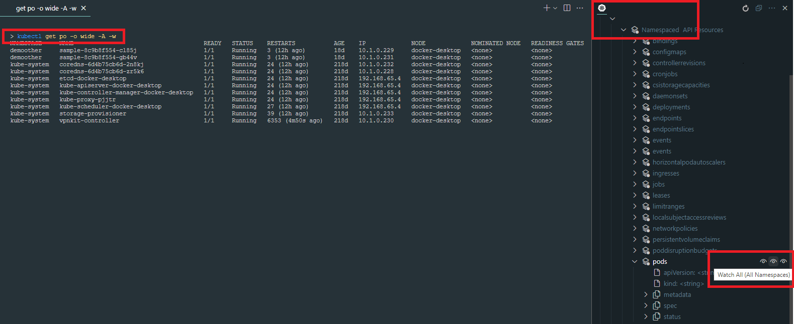

# Kubernetes Api Resources Explorer

This VSCode extension builds on top of [Kuber netes](https://marketplace.visualstudio.com/items?itemName=ms-kubernetes-tools.vscode-kubernetes-tools) VSCode extension.

## Features

Discover Kubernetes API resources using `kubectl api-resources` and show in Cluster Explorer view.

The API Resource tree is built by drilling down using `kubectl explain`.

## What is new

- Get Selected command
- Watch commands (👁 icon) - run in terminal
- Integrate with extension [Kubernetes Commander](https://marketplace.visualstudio.com/items?itemName=sandipchitale.vscode-kubernetes-commander-editor).
- Shows standard icons for API resources.

### Commands

|Icon|Command|Description|
|-|-|-|
||Explain|Explain resource type|
||Describe All|Describe all items of resource type|
||Describe All(All Namespaces)|Describe all items from all namespaces of resource type|
||Describe Selected|Describe selected items of resource type|
||Get All|Get all items of resource type|
||Get All(All Namespaces)|Get all items from all namespaces of resource type|
||Get Selected|Get selected items of resource type|
||Load All|Load all items of resource type|
||Load All(All Namespaces)|Load all items from all namespaces of resource type|
||Load Selected|Load selected items of resource type|
|👁| Watch All |Watch all items of resource type in a terminal|
|👁|Watch All(All Namespaces)|Watch all items from all namespaces of resource type  in a terminal|
|👁|Watch Selected|Watch selected items of resource type in a terminal|

## Known Issues

None.

[File a issue](https://github.com/sandipchitale/vscode-kubernetes-api-resources/issues)

## Release Notes

### 1.0.5

Initial release.

## See also

- [Kubernetes Commander](https://marketplace.visualstudio.com/items?itemName=sandipchitale.vscode-kubernetes-commander-editor)
- [Kubernetes Pod File System Explorer and extras](https://marketplace.visualstudio.com/items?itemName=sandipchitale.kubernetes-file-system-explorer)
- [Helm Extras](https://marketplace.visualstudio.com/items?itemName=sandipchitale.vscode-kubernetes-helm-extras)

